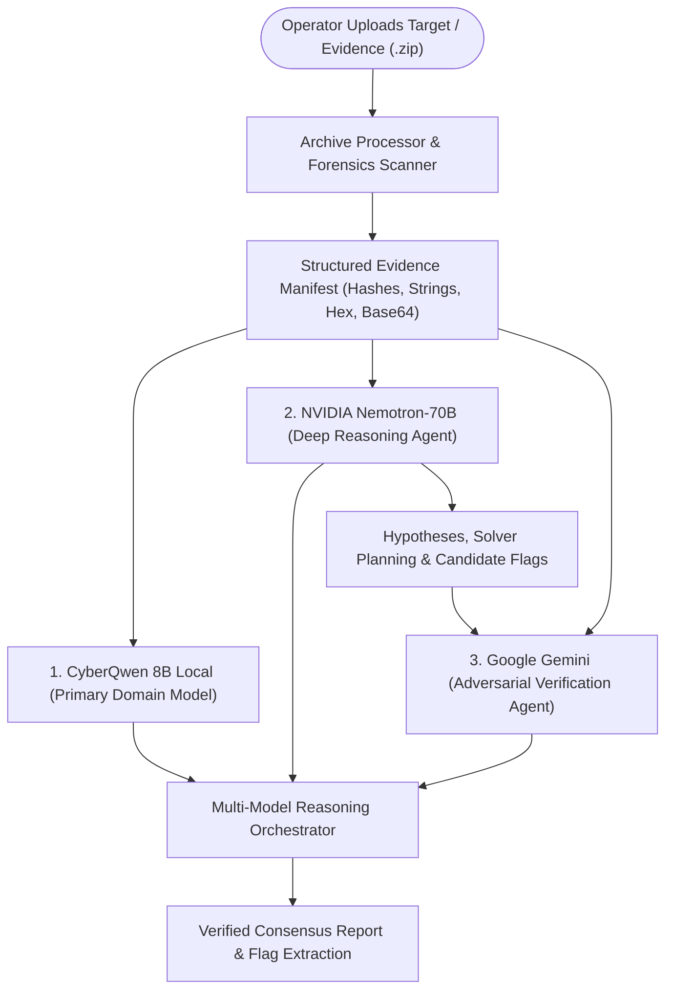

# CyberQwen-AI: Cybersecurity LLM & QLoRA Fine-Tuning Pipeline

CyberQwen-AI is an end-to-end specialized artificial intelligence platform for offensive and defensive cybersecurity operations, CTF challenges, binary reverse engineering, malware analysis, digital forensics, secure coding, and automated AI pair-programming with Aider.

---

## 📁 Project Architecture & Folder Structure

```text
CyberQwen-AI/
├── .env                          # API keys (NVIDIA_API_KEY, GEMINI_API_KEY, etc.)
├── .venv/                        # Isolated Python 3.11 Virtual Environment
├── Modelfile                     # Ollama configuration and system instructions
├── README.md                     # Complete pipeline documentation
├── requirements.txt              # Standardized dependency specifications
├── start_backend.bat             # 1-click FastAPI backend launcher (Port 8000)
├── start_frontend.bat            # 1-click React + Vite UI launcher (Port 5173)
│
├── backend/                      # Multi-Model Collaborative Intelligence Backend
│   ├── main.py                   # REST endpoints (/health, /chat, /upload, /analyze)
│   ├── model_service.py          # In-memory CyberQwen-Merged runner & document parser
│   ├── archive_processor.py      # Multi-file ZIP extractor & deep artifact scanner
│   ├── nemotron_client.py        # NVIDIA Nemotron-70B deep reasoning agent
│   ├── gemini_client.py          # Google Gemini adversarial verification agent
│   ├── reasoning_orchestrator.py # Multi-model consensus synthesis engine
│   └── test_api_suite.py         # Automated endpoint test suite
│
├── frontend/                     # Futuristic CyberQwen Web Interface (React + Vite)
│   ├── src/                      # Glassmorphism, Tailwind, Neon accents & Chat components
│   ├── package.json              # Frontend package definitions
│   └── vite.config.js            # Vite configuration
│
├── dataset/
│   ├── final/                    # Production 4-tier progressive curriculum (v3)
│   ├── ctf/                      # CTF Chain-of-Evidence dataset & 100-sample benchmark
│   └── raw/                      # CISA KEV, YARA rules, OWASP security corpus
│
├── models/
│   ├── CyberQwen-Merged/         # Fully merged standalone model weights (model.safetensors)
│   ├── CyberQwen-CTF-LoRA/       # Fine-tuned CTF LoRA adapter
│   └── test-CyberQwen-LoRA/      # Validated LoRA adapter weights & checkpoints
│
├── logs/                         # Benchmark evaluations and telemetry metrics
└── scripts/                      # Complete QLoRA fine-tuning & evaluation tooling
```

---

## 🤖 Multi-Agent CyberQwen Architecture

CyberQwen operates as a collaborative multi-model consensus system:



### Tri-Model Responsibilities:
1. **CyberQwen 8B Local (Primary Model)**: Direct domain-specific causal language model fine-tuned on cybersecurity corpora for rapid token generation, vulnerability triage, and exploit mechanics.
2. **NVIDIA Nemotron-70B (Deep Reasoning Agent)**: Formulates multi-step solver hypotheses, analyzes cryptographic schedules, and plans reverse engineering approaches.
3. **Google Gemini (Adversarial Verification Agent)**: Performs hallucination checks against raw evidence bytes, verifying that candidate flags are mathematically and forensically confirmed before final output.

---

## ⚙️ Environment & Installation

### Requirements
- **OS**: Windows 11 / Linux
- **Python**: 3.11 (Required for PyTorch CUDA, bitsandbytes, and precompiled wheels)
- **Package Manager**: `uv` or `pip`
- **Ollama**: Installed and running (`ollama serve`)

### Setup Environment
```powershell
# 1. Navigate to workspace
cd C:\Users\KIIT\Desktop\CyberQwen-AI

# 2. Activate virtual environment
.\.venv\Scripts\Activate.ps1

# 3. Verify packages
python -c "import torch, transformers, peft, trl, bitsandbytes, fastapi, uvicorn; print('Environment Ready!')"
```

---

## 🌐 1-Click Live Web Interface & REST API

CyberQwen-AI provides a live local web interface with chat, file analysis dropzone, and presets.

### Quick Start (Double-Click Batch Scripts)
1. **Launch Backend**: Double-click `start_backend.bat` (Starts FastAPI at `http://localhost:8000`)
2. **Launch Frontend**: Double-click `start_frontend.bat` (Starts React/Vite at `http://localhost:5173`)

### Manual Start
```powershell
# Terminal 1: Start FastAPI REST API Server
.\.venv\Scripts\Activate.ps1
uvicorn backend.main:app --host 0.0.0.0 --port 8000

# Terminal 2: Start Vite React Web Interface
cd frontend
npm run dev
```

- **Frontend URL**: 👉 `http://localhost:5173`
- **Backend API & Swagger Docs**: 👉 `http://localhost:8000/docs`

---

## 🛠️ Complete Pipeline Execution

### 1. Dataset Preparation & Preprocessing

The dataset pipeline generates, cleans, and structures training samples into Qwen3 chat format (`messages`).

```powershell
# Step 1A: Clean raw datasets (normalizes text, eliminates low-quality patterns, removes duplicates)
python scripts/clean_dataset.py --categories generated secure_coding

# Step 1B: Merge and split into train (90%) and validation (10%) sets
python scripts/merge_dataset.py --train-ratio 0.9 --seed 42
```

Outputs generated:
- `dataset/merged/train.jsonl`
- `dataset/merged/val.jsonl`

---

### 2. QLoRA 4-Bit Fine-Tuning

The training script `scripts/train_qlora.py` uses `transformers`, `peft`, `bitsandbytes`, and `trl.SFTTrainer`.

#### Key Features:
- **Quantization**: 4-bit NormalFloat4 (NF4) with double quantization and bfloat16 compute dtype.
- **LoRA Configuration**: Rank ($r$) = 16, Alpha ($\alpha$) = 32, Dropout = 0.05.
- **Target Modules**: `q_proj`, `k_proj`, `v_proj`, `o_proj`, `gate_proj`, `up_proj`, `down_proj`.
- **Memory Optimizations**: `prepare_model_for_kbit_training`, gradient checkpointing, `paged_adamw_32bit`.
- **Checkpoint Resumption**: Supports resuming training seamlessly via `--resume_from_checkpoint`.

```powershell
# Launch Production QLoRA Fine-Tuning
python scripts/train_qlora.py `
  --model_id "Qwen/Qwen3-8B" `
  --train_path "dataset/final/train_v2.jsonl" `
  --val_path "dataset/final/validation_v2.jsonl" `
  --output_dir "models/CyberQwen-LoRA" `
  --epochs 3 `
  --batch_size 1 `
  --grad_accum 16 `
  --lr 2e-4
```

Adapter weights and tokenizer are saved to `models/CyberQwen-LoRA/`.

---

### 3. Model Evaluation & Benchmarking

Evaluate CyberQwen across 6 core cybersecurity disciplines:
1. **CTF Solving**: Binary unpacking, Ghidra analysis, flag extraction.
2. **Cryptography**: RSA attacks (Bleichenbacher), padding oracles, OAEP.
3. **Web Security**: SSRF to AWS IMDSv2 exploitation, XSS, SQLi.
4. **Malware Analysis**: Process Hollowing, API evasion, anti-debugging.
5. **Digital Forensics**: Memory dumps, Volatility 3 plugins (`malfind`, `pslist`).
6. **Linux Security**: Privilege escalation, GTFOBins, SUID binaries.

```powershell
# Evaluate via Ollama backend
python scripts/evaluate_model.py --backend ollama --ollama_model cyberqwen

# Evaluate via Hugging Face LoRA weights
python scripts/evaluate_model.py --backend hf --base_model "Qwen/Qwen3-8B" --lora_path "models/CyberQwen-LoRA"

# Interactive cybersecurity assistant mode
python scripts/evaluate_model.py --interactive --ollama_model cyberqwen
```

---

### 4. LoRA Adapter Export & Weight Merging

To convert your trained LoRA adapter into a standalone model (e.g. for GGUF quantization or Hugging Face Hub sharing):

```powershell
# Merge LoRA weights into base model
python scripts/export_lora.py `
  --base_model "Qwen/Qwen3-8B" `
  --lora_path "models/CyberQwen-LoRA" `
  --output_dir "models/CyberQwen-Merged"
```

---

### 5. Ollama Model Creation & Local Deployment

Create and deploy the customized `cyberqwen` model directly into your local Ollama server:

```powershell
# Build Modelfile and register model in Ollama
python scripts/create_ollama_model.py --base_model "qwen3:8b" --model_name "cyberqwen" --test
```

#### Running CyberQwen in Terminal
```powershell
ollama run cyberqwen
```

---

### 6. AI Coding Assistant with Aider

Integrate CyberQwen directly into your development workflow with `aider-chat`:

```powershell
# Pair-program with local CyberQwen via Ollama
aider --model ollama/cyberqwen

# Or pair-program with NVIDIA API / OpenAI-compatible endpoint
$env:OPENAI_API_BASE = "https://integrate.api.nvidia.com/v1"
$env:OPENAI_API_KEY = "nvapi-your-key-here"
aider --model openai/meta/llama-3.3-70b-instruct
```
